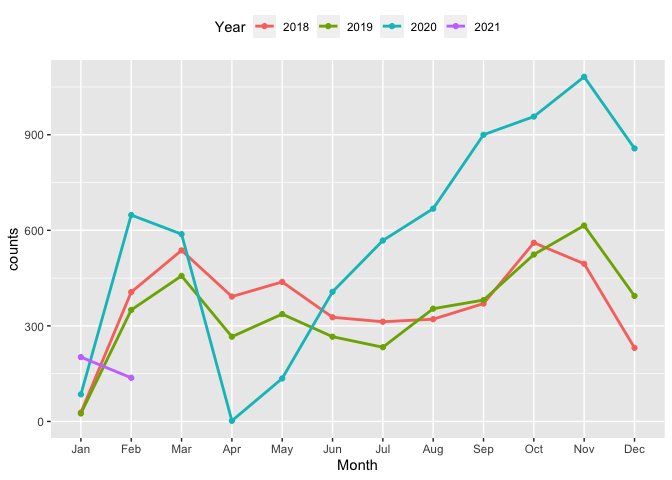

<!-- README.md is generated from README.Rmd. Please edit that file -->

# kiaora

<!-- badges: start -->

<!-- badges: end -->

The goal of kiaora is to provide functions to get Auckland transport
information and residential auction results for NZ property, including
property information,auction price and dates, rating value and dates.

## Installation

You can install the released version of kiaora from
[CRAN](https://CRAN.R-project.org) with:

``` r
install.packages("kiaora")
```

And the development version from [GitHub](https://github.com/) with:

``` r
# install.packages("devtools")
devtools::install_github("Tina-ye112/kiaora")
```

## Usage

This function contains 3 parameters that are region, district, area.You
could input the region for the place that you are interested in, and the
function would return a tibble with auction property price and other
basic information. Or leave the parameters to be NULL, the function
would return all auction results by default.

Here is an example for auction results of Northland region.

``` r
library(kiaora)
library(dplyr)
#> 
#> Attaching package: 'dplyr'
#> The following objects are masked from 'package:stats':
#> 
#>     filter, lag
#> The following objects are masked from 'package:base':
#> 
#>     intersect, setdiff, setequal, union
library(stringr)
library(lubridate)
#> 
#> Attaching package: 'lubridate'
#> The following objects are masked from 'package:base':
#> 
#>     date, intersect, setdiff, union
```

``` r
get_property_auction_price(region = "Northland",district = NULL,area = NULL)
#> # A tibble: 133 x 10
#>    region district property_address auction_price auction_dates bedrooms
#>    <chr>  <chr>    <chr>                    <dbl> <date>           <dbl>
#>  1 North… Kaipara  73 Old Waipu Ro…       2250000 2021-02-11           4
#>  2 North… Far Nor… 80 Rangitane Lo…        676000 2021-02-04           3
#>  3 North… Kaipara  30 Lincoln Stre…       1210000 2021-02-03           3
#>  4 North… Kaipara  31 Moir Street,…        680000 2021-01-28           2
#>  5 North… Far Nor… 120 Ota Point R…        520000 2021-01-21           4
#>  6 North… Far Nor… 21 Kemp Road, K…        990000 2021-01-21           3
#>  7 North… Kaipara  1 Lincoln Stree…       2600000 2020-12-17           5
#>  8 North… Whangar… 5/26 Percy Stre…        487500 2020-12-16           2
#>  9 North… Far Nor… 40 Hall Road, K…       1096000 2020-12-10           3
#> 10 North… Whangar… 39 Percy Street…        570000 2020-12-09           3
#> # … with 123 more rows, and 4 more variables: bathrooms <dbl>,
#> #   car_parking <dbl>, rating_value <dbl>, rating_dates <date>
```

Here is the line graph illustrates the number of auction properties sold
for New Zealand over months from 2018 to early in 2021.

``` r
library(ggplot2)
dataset <- nzhousingprice %>%
  mutate(
    group = ifelse(region == "Auckland", region, "Others"),
    auction_yrmth = zoo::as.yearmon(auction_dates)
  )
dataset_month <- dataset %>%
  mutate(
    month = month(auction_dates, label = TRUE),
    year = as.factor(year(auction_dates))) %>%
  group_by(month, year) %>%
  summarise(counts = n())
#> `summarise()` has grouped output by 'month'. You can override using the `.groups` argument.
ggplot(dataset_month, aes(month, counts, group = year, colour = year)) +
  geom_line(size = 1) +
  geom_point() +
  labs(x = "Month", colour = "Year") +
  theme(legend.position = "top") 
```


