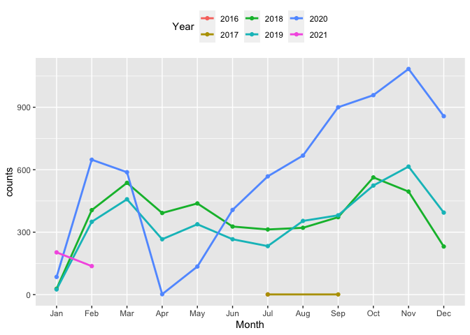

<!-- README.md is generated from README.Rmd. Please edit that file -->

# kiaora

<!-- badges: start -->

<!-- badges: end -->

The goal of kiaora is to provide functions to get Auckland transport
information and residential auction results for NZ property, including
property information,auction price and dates, rating value and dates.

## Installation

You can install the released version of kiaora from
[CRAN](https://CRAN.R-project.org) with:

``` r
install.packages("kiaora")
```

And the development version from [GitHub](https://github.com/) with:

``` r
# install.packages("devtools")
devtools::install_github("Tina-ye112/kiaora")
```

## Usage

This function contains 3 parameters that are region, district, area.You
could …

``` r
library(kiaora)
```

``` r
get_property_auction_price(region = "Northland",district = NULL,area = NULL)
```

What is special about using `README.Rmd` instead of just `README.md`?
You can include R chunks like so:

``` r
summary(nzhousingprice)
#>     region            district         property_address   auction_price      
#>  Length:15770       Length:15770       Length:15770       Min.   :1.300e+01  
#>  Class :character   Class :character   Class :character   1st Qu.:6.900e+05  
#>  Mode  :character   Mode  :character   Mode  :character   Median :9.350e+05  
#>                                                           Mean   :8.500e+08  
#>                                                           3rd Qu.:1.305e+06  
#>                                                           Max.   :1.202e+13  
#>                                                           NA's   :1332       
#>  auction_dates           bedrooms        bathrooms        car_parking    
#>  Min.   :2016-07-01   Min.   : 1.000   Min.   :  1.000   Min.   : 1.000  
#>  1st Qu.:2018-11-15   1st Qu.: 3.000   1st Qu.:  1.000   1st Qu.: 1.000  
#>  Median :2019-11-14   Median : 3.000   Median :  2.000   Median : 2.000  
#>  Mean   :2019-10-05   Mean   : 3.384   Mean   :  1.745   Mean   : 1.787  
#>  3rd Qu.:2020-09-03   3rd Qu.: 4.000   3rd Qu.:  2.000   3rd Qu.: 2.000  
#>  Max.   :2021-02-02   Max.   :65.000   Max.   :150.000   Max.   :33.000  
#>                       NA's   :238      NA's   :205       NA's   :2058    
#>   rating_value       rating_dates       
#>  Min.   :    3000   Min.   :2015-07-01  
#>  1st Qu.:  650000   1st Qu.:2017-07-01  
#>  Median :  885000   Median :2017-07-01  
#>  Mean   :  995096   Mean   :2017-08-22  
#>  3rd Qu.: 1200000   3rd Qu.:2017-07-01  
#>  Max.   :11000000   Max.   :2020-09-01  
#>  NA's   :3490       NA's   :3685
```

You’ll still need to render `README.Rmd` regularly, to keep `README.md`
up-to-date.

You can also embed plots, for example:

``` r
library(ggplot2)
ggplot(data=subset(nzhousingprice,region=="Auckland"&district=="North Shore City"))+
  geom_line(aes(x=auction_dates,y=auction_price))
```



In that case, don’t forget to commit and push the resulting figure
files, so they display on GitHub\!
